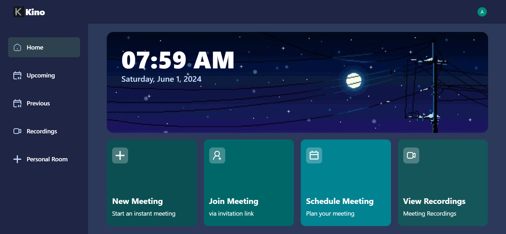
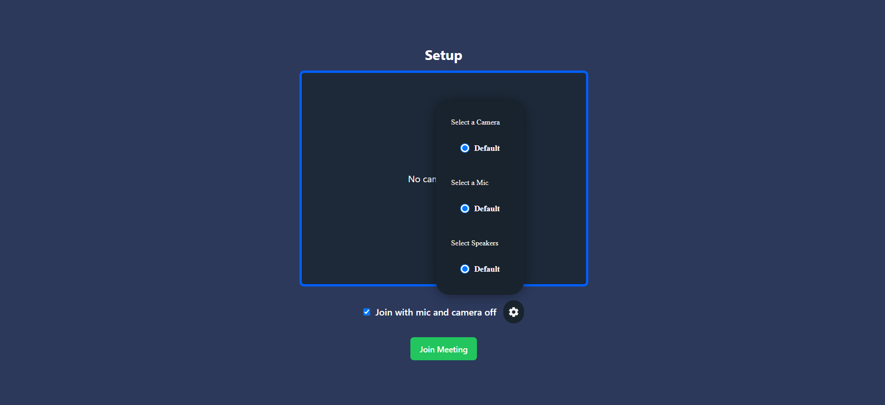
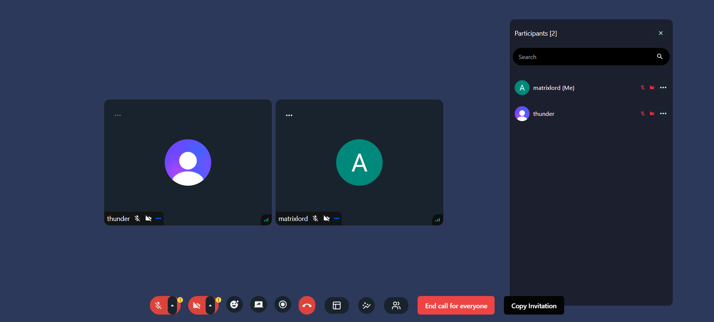
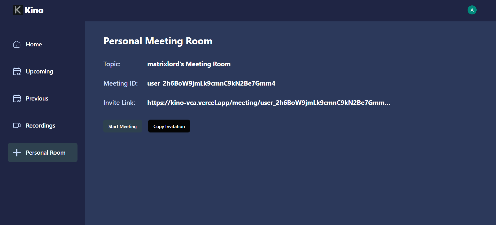

# Video Conferencing App

## Description
Kino Video Conferencing App is a modern, feature-rich application designed to facilitate seamless and secure video communication. Built using the powerful combination of Next.js, Clerk, Stream, and Tailwind CSS, this application provides a robust and user-friendly platform for video calls.

Have a peek: https://kino-vca.vercel.app/sign-in?redirect_url=https%3A%2F%2Fkino-vca.vercel.app%2F 
##

## Acknowledgments

- [Next.js](https://nextjs.org/)
- [Tailwind CSS](https://tailwindcss.com/)
- [Clerk](https://clerk.dev/)
- [Stream](https://getstream.io/)
